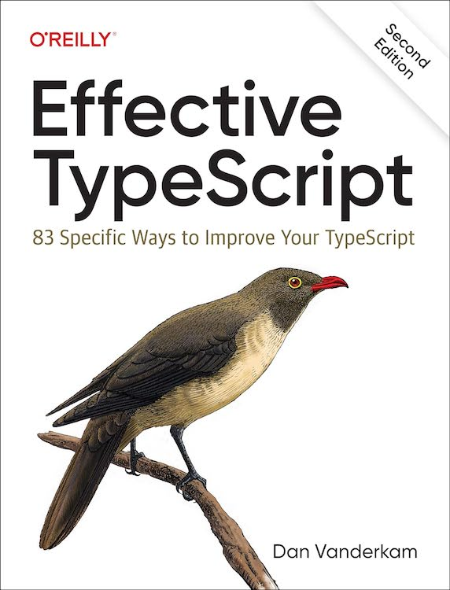

# 《Effective Typescript》中文第二版

_提升 TypeScript 的 83 条具体方法_

原书作者：[Dan Vanderkam](https://github.com/danvk)

> “Effective TypeScript by Dan Vanderkam (O’Reilly). Copyright 2020 Dan Vanderkam, 978-1-492-05374-3.”

## 目录

- **第 1 章：认识 TypeScript**

  - [📝 第 1 条](./docs/ch-intro/ts-vs-js.md): 理解 TypeScript 与 JavaScript 的关系
  - [📝 第 2 条](./docs/ch-intro/which-ts.md): 了解你正在使用哪些 TypeScript 配置项
  - [📝 第 3 条](./docs/ch-intro/independent.md): 理解代码生成与类型系统是相互独立的
  - [📝 第 4 条](./docs/ch-intro/structural.md): 熟悉结构化类型
  - [📝 第 5 条](./docs/ch-intro/any.md): 限制 `any` 类型的使用

- **第 2 章：TypeScript 的类型系统**

  - [📝 第 6 条](./docs/ch-types/editor.md): 利用编辑器探索类型系统
  - [📝 第 7 条](./docs/ch-types/types-as-sets.md): 把类型看作值的集合
  - [📝 第 8 条](./docs/ch-types/type-value-space.md): 了解符号处于类型空间还是值空间
  - [📝 第 9 条](./docs/ch-types/prefer-declarations-to-assertions.md): 优先使用类型注解而非类型断言
  - [📝 第 10 条](./docs/ch-types/avoid-object-wrapper-types.md): 避免使用对象包装类型（String, Number, Boolean, Symbol, BigInt）
  - [📝 第 11 条](./docs/ch-types/excess-property-checking.md): 区分多余属性检查与类型检查
  - [📝 第 12 条](./docs/ch-types/type-entire-functions.md): 尽可能为整个函数表达式应用类型
  - [📝 第 13 条](./docs/ch-types/type-vs-interface.md): 了解 `type` 与 `interface` 的区别
  - [📝 第 14 条](./docs/ch-types/readonly.md): 使用 `readonly` 防止因可变性引发的错误
  - [📝 第 15 条](./docs/ch-types/map-between-types.md): 利用类型运算和泛型减少重复
  - [📝 第 16 条](./docs/ch-types/index-for-dynamic.md): 优先使用更精确的索引签名替代方案
  - [📝 第 17 条](./docs/ch-types/number-index.md): 避免数字索引签名

- **第 3 章：类型推断与控制流分析**

  - [📝 第 18 条](./docs/ch-inference/avoid-inferable.md): 避免在代码中添加可推断的类型
  - [📝 第 19 条](./docs/ch-inference/one-var-one-type.md): 不同类型使用不同变量
  - [📝 第 20 条](./docs/ch-inference/widening.md): 理解变量如何获得类型
  - [📝 第 21 条](./docs/ch-inference/all-at-once.md): 一次性创建对象
  - [📝 第 22 条](./docs/ch-inference/narrowing.md): 理解类型收窄
  - [📝 第 23 条](./docs/ch-inference/avoid-aliasing.md): 保持别名使用的一致性
  - [📝 第 24 条](./docs/ch-inference/context-inference.md): 理解上下文在类型推断中的作用
  - [📝 第 25 条](./docs/ch-inference/evolving-any.md): 理解类型演变
  - [📝 第 26 条](./docs/ch-inference/functional-libraries.md): 使用函数式构造和库帮助类型流动
  - [📝 第 27 条](./docs/ch-inference/use-async-await.md): 使用 async 函数替代回调以改善类型流动
  - [📝 第 28 条](./docs/ch-inference/inference-sites.md): 使用类和柯里化创建新的推断点

- **第 4 章：类型设计**

  - [📝 第 29 条](./docs/ch-design/valid-states.md): 优先设计始终表示有效状态的类型
  - [📝 第 30 条](./docs/ch-design/loose-accept-strict-produce.md): 接受要宽松，输出要严格
  - [📝 第 31 条](./docs/ch-design/jsdoc-repeat.md): 不要在文档中重复类型信息
  - [📝 第 32 条](./docs/ch-design/null-in-type.md): 避免在类型别名中包含 `null` 或 `undefined`
  - [📝 第 33 条](./docs/ch-design/null-values-to-perimeter.md): 将 null 值推至类型边界
  - [📝 第 34 条](./docs/ch-design/union-of-interfaces.md): 优先使用接口的联合而非联合中的接口
  - [📝 第 35 条](./docs/ch-design/avoid-strings.md): 使用更精确的替代方案代替字符串类型
  - [📝 第 36 条](./docs/ch-design/in-domain-null.md): 为特殊值使用独立类型
  - [📝 第 37 条](./docs/ch-design/avoid-optional.md): 限制可选属性的使用
  - [📝 第 38 条](./docs/ch-design/same-type-params.md): 避免重复的同类型参数
  - [📝 第 39 条](./docs/ch-design/unify.md): 优先统一类型，而非建模差异
  - [📝 第 40 条](./docs/ch-design/incomplete-over-inaccurate.md): 不精确的类型优于不准确的类型
  - [📝 第 41 条](./docs/ch-design/language-of-domain.md): 使用领域语言为类型命名
  - [📝 第 42 条](./docs/ch-design/consider-codegen.md): 避免基于个人经验数据的类型

- **第 5 章：类型的不安全性与 `any` 类型**

  - [📝 第 43 条](./docs/ch-any/narrowest-any.md): 使用最小的作用域来限制 `any` 类型
  - [📝 第 44 条](./docs/ch-any/specific-any.md): 优先使用更精确的 `any` 替代方案，而不是简单的 `any`
  - [📝 第 45 条](./docs/ch-any/hide-unsafe-casts.md): 在类型良好的函数中隐藏不安全的类型断言
  - [📝 第 46 条](./docs/ch-any/never-unknown.md): 对于未知类型的值，使用 `unknown` 替代 `any`
  - [📝 第 47 条](./docs/ch-any/type-safe-monkey.md): 优先采用类型安全的方法来进行猴子补丁
  - [📝 第 48 条](./docs/ch-any/unsoundness.md): 避免类型安全性陷阱
  - [📝 第 49 条](./docs/ch-any/type-percentage.md): 跟踪类型覆盖率，防止类型安全性回归

- **第 6 章：泛型与类型层级编程**

  - [📝 第 50 条](./docs/ch-generics/functions-on-types.md): 将泛型视为类型之间的函数
  - [📝 第 51 条](./docs/ch-generics/golden-rule.md): 避免不必要的类型参数
  - [📝 第 52 条](./docs/ch-generics/conditional-overload.md): 优先使用条件类型而非重载签名
  - [📝 第 53 条](./docs/ch-generics/control-distribution.md): 了解如何控制条件类型中的联合分布
  - [📝 第 54 条](./docs/ch-generics/template-dsl.md): 使用模板字面量类型来建模领域特定语言（DSL）及字符串之间的关系
  - [📝 第 55 条](./docs/ch-generics/test-your-types.md): 为你的类型编写测试
  - [📝 第 56 条](./docs/ch-generics/type-display.md): 注意类型的显示方式
  - [📝 第 57 条](./docs/ch-generics/tail-recursion.md): 优先使用尾递归泛型类型
  - [📝 第 58 条](./docs/ch-generics/codegen-alt.md): 将代码生成作为复杂类型的替代方案

- **第 7 章：TypeScript 配方**

  - [📝 第 59 条](./docs/ch-recipes/exhaustiveness.md): 使用 `never` 类型进行穷举检查
  - [📝 第 60 条](./docs/ch-recipes/iterate-objects.md): 了解如何遍历对象
  - [📝 第 61 条](./docs/ch-recipes/values-in-sync.md): 使用 `Record` 类型保持值的同步
  - [📝 第 62 条](./docs/ch-recipes/conditional-varargs.md): 使用 Rest 参数和元组类型来建模可变参数函数
  - [📝 第 63 条](./docs/ch-recipes/optional-never.md): 使用可选的 `never` 属性来建模独占或
  - [📝 第 64 条](./docs/ch-recipes/brands.md): 考虑使用品牌进行命名类型

- **第 8 章：类型声明与 @types**

  - [📝 第 65 条](./docs/ch-declarations/dev-dependencies.md): 将 TypeScript 和 `@types` 放入 `devDependencies`
  - [📝 第 66 条](./docs/ch-declarations/three-versions.md): 理解类型声明中涉及的三种版本
  - [📝 第 67 条](./docs/ch-declarations/export-your-types.md): 导出所有出现在公共 API 中的类型
  - [📝 第 68 条](./docs/ch-declarations/use-tsdoc.md): 使用 TSDoc 进行 API 注释
  - [📝 第 69 条](./docs/ch-declarations/this-in-callbacks.md): 如果回调函数的 API 中包含 `this`，为其提供类型
  - [📝 第 70 条](./docs/ch-declarations/mirror-types-for-deps.md): 镜像类型以解耦依赖关系
  - [📝 第 71 条](./docs/ch-declarations/augment-improve.md): 使用模块增强改善类型

- **第 9 章：编写与运行代码**

  - [📝 第 72 条](./docs/ch-write-run/avoid-non-ecma.md): 优先使用 ECMAScript 特性而非 TypeScript 特性
  - [📝 第 73 条](./docs/ch-write-run/source-maps-debug.md): 使用源映射调试 TypeScript
  - [📝 第 74 条](./docs/ch-write-run/runtime-types.md): 了解如何在运行时重构类型
  - [📝 第 75 条](./docs/ch-write-run/understand-the-dom.md): 理解 DOM 层级结构
  - [📝 第 76 条](./docs/ch-write-run/model-env.md): 创建准确的环境模型
  - [📝 第 77 条](./docs/ch-write-run/types-or-tests.md): 了解类型检查与单元测试之间的关系
  - [📝 第 78 条](./docs/ch-write-run/performance.md): 关注编译器性能

- **第 10 章：现代化与迁移**
  - [📝 第 79 条](./docs/ch-migrate/write-modern-js.md): 编写现代 JavaScript
  - [📝 第 80 条](./docs/ch-migrate/jsdoc-tscheck.md): 使用 `@ts-check` 和 JSDoc 体验 TypeScript
  - [📝 第 81 条](./docs/ch-migrate/allowjs.md): 使用 `allowJs` 混合使用 TypeScript 和 JavaScript
  - [📝 第 82 条](./docs/ch-migrate/convert-up-the-graph.md): 按模块逐步向上转换你的依赖图
  - [📝 第 83 条](./docs/ch-migrate/start-loose.md): 在启用 `noImplicitAny` 之前，不要认为迁移完成
